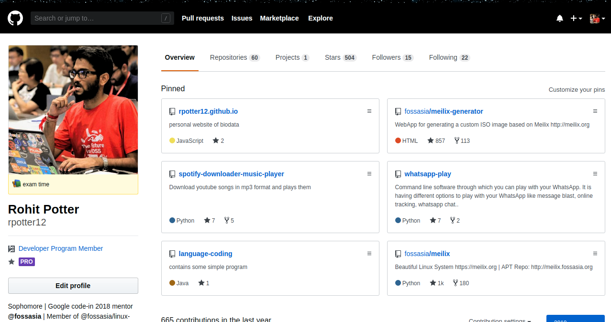
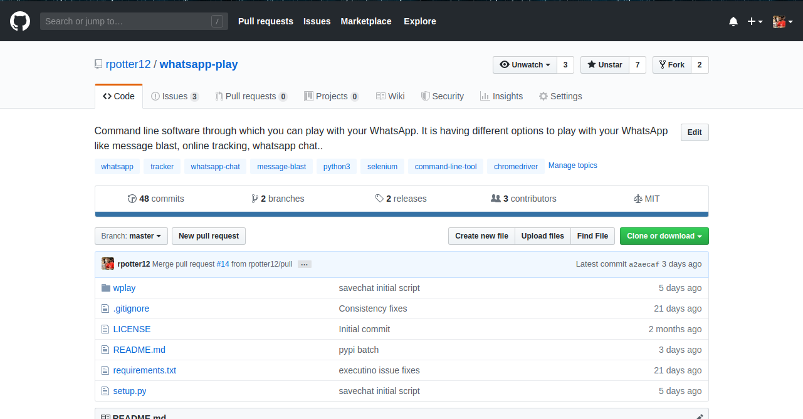

# How to start using GitHub
(Publish date: 22 June 2019)  

## About GitHub
GitHub, a subsidiary of Microsoft, is an American web-based hosting service for version control using Git. It is mostly used for computer code. It offers all of the distributed version control and source code management (SCM) functionality of Git as well as adding its own features.

It provides access control and several collaboration features such as bug tracking, feature requests, task management, and wikis for every project.

GitHub is commonly used to host open source software projects. It is the largest host of source code in the world.

## Steps to start on Github
(Gain basic knowlege of GitHub and Git from any youtube tutorial or any documentation)

**Step 1** - Create a account on GitHub 
**Step 2** - Open your profile. Example:    
**Step 3** - Choose language on which you want to work 
**Step 4** - Search that language in the search bar which is present in the upper left corner. 
**Step 5** - Select project which you find interesting to work. Example:   
**Step 6** - Fork that repository by clicking on the fork button which is present in upper right corner of the repository. (This will create a copy of that repository in your profile's repository section) 
**Step 7** - Download that repository in your system by using command: `git clone <link_of_the_repository>`. 
**Step 8** - Firstly try to execute that project in your local system by reading the README.md file. If you are facing any problem in execution of the project search that problem on Google search and then also you are facing problem then open a issue in the issue section of the project. The project developers will help you in solving that problem. 
**Step 9** - After the successful execution of the project, start analyzing code, find bugs or add features and commit changes in your forked repository. 
**Step 10** - Open a pull request of the changes you have commit in the main repository. 

